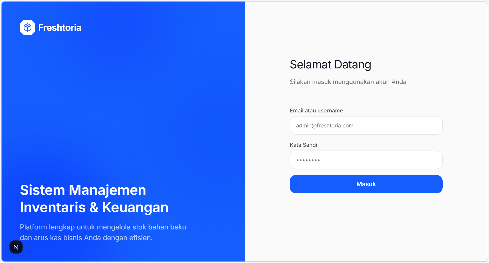
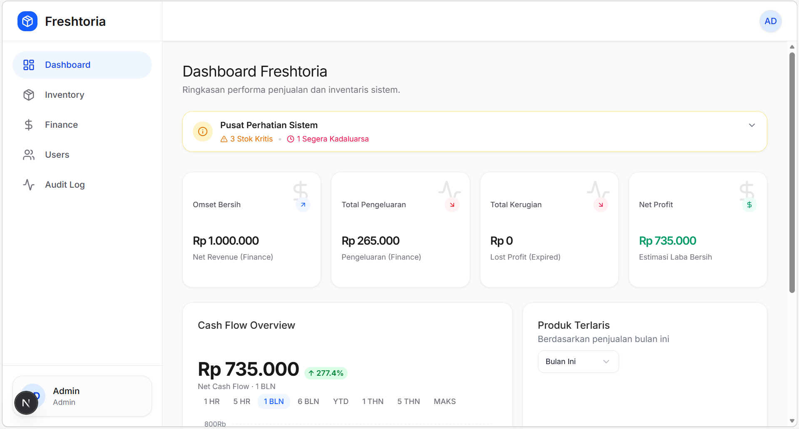
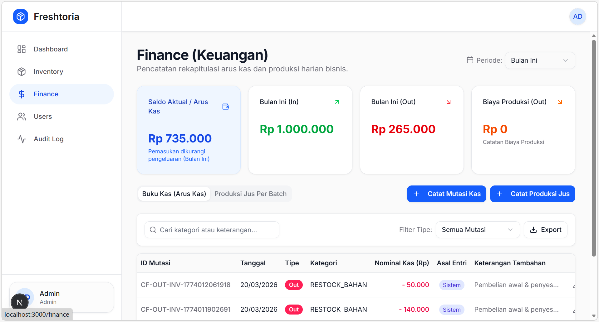
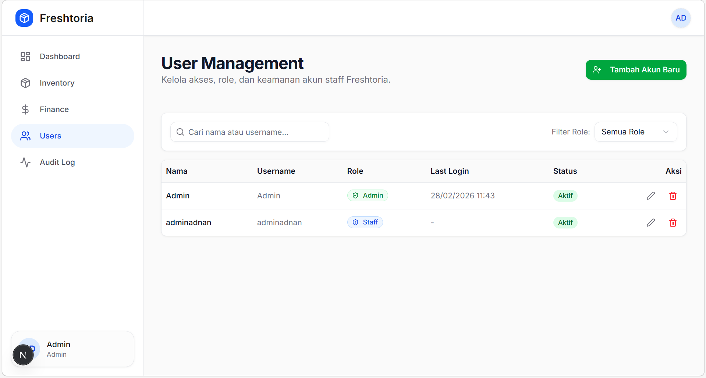
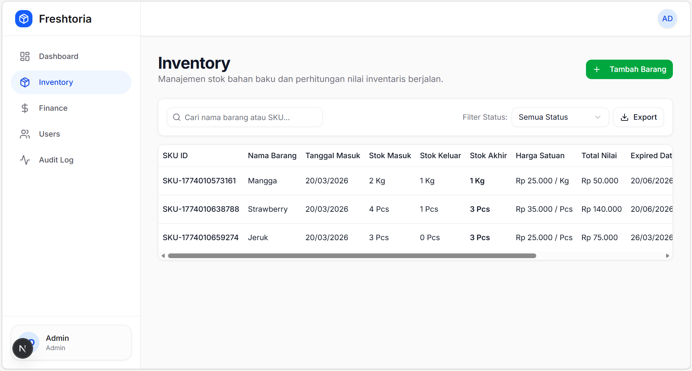

# 🚀 Freshtoria Dashboard

**Quality-Driven E-Commerce Dashboard with Modern Fullstack Architecture**

---

## 👋 Overview

Freshtoria Dashboard is a modern e-commerce admin platform built to manage products, orders, and sales with efficiency and reliability.

This project is developed with a **QA-first mindset**, ensuring every feature is tested, scalable, and production-ready.

> Building systems is important. Ensuring they work flawlessly is what matters.

---

## ✨ Key Features

### 🛒 Product Management

- Full CRUD for products
- Inventory & category handling
- Optimistic UI updates for better UX

### 📦 Order Management

- Order tracking & status updates
- Detailed order insights
- Real-world workflow simulation

### 📊 Dashboard Analytics

- Sales overview & metrics
- Clean and responsive UI
- Data-driven layout

### 🔐 Authentication

- Secure authentication using BetterAuth
- Session & access control

---

## 🧪 QA & Testing Strategy (Core Differentiator)

This project treats **quality as a core feature, not an afterthought**.

### ✅ Testing Coverage

- End-to-End Testing (critical user flows)
- UI Validation (visual & interaction)
- Functional Testing (business logic)

### ⚙️ Automation with Playwright

- Stable selectors & reusable test utilities
- Parallel test execution
- Isolated test environment

### 🎯 QA Principles Applied

- Test real user scenarios
- Catch regressions early
- Ensure consistent behavior across features

### 🐞 Bugs Found & Fixed

- Fixed inconsistent state on product update
- Resolved authentication edge case on session expiry
- Improved UI validation for empty form submission

---

## 🧱 Tech Stack

### Frontend

- Next.js (App Router)
- TypeScript
- Tailwind CSS _(adjust if needed)_

### Backend

- SQLite (lightweight database)
- Drizzle ORM (type-safe queries)
- BetterAuth (authentication system)

### QA Automation

- Playwright
- TypeScript-based test structure

---

## 📂 Project Structure

```bash
freshtoria-dashboard/
│
├── app/               # Next.js app router
├── components/        # Reusable UI components
├── lib/               # DB, auth, utilities
├── db/                # Schema & database config (Drizzle)
├── tests/             # Playwright e2e tests
├── public/            # Static assets
└── README.md
```

---

## 🚀 Getting Started

### 1. Clone Repository

```bash
git clone https://github.com/adnanyazidar/freshtoria-dashboard.git
cd freshtoria-dashboard
```

### 2. Install Dependencies

```bash
npm install
```

### 3. Setup Environment

```bash
cp .env.example .env
```

### 4. Run Development Server

```bash
npm run dev
```

### 5. Run E2E Tests

```bash
npx playwright test
```

---

## 🧪 Example Test Scenarios

- ✅ User login flow
- ✅ Create new product
- ✅ Update product data
- ✅ Checkout / order flow
- ✅ Regression for critical paths

---

## 📸 Preview

_(Add screenshot / demo GIF here)_






---

## 🎯 Engineering Highlights

- 🧪 QA-first development approach
- ⚡ Type-safe fullstack (Drizzle + TypeScript)
- 🔐 Secure authentication flow
- 🧱 Scalable and clean architecture
- 🎯 Built with real-world product mindset

---

## 📈 Future Improvements

- CI/CD integration (GitHub Actions + Playwright)
- Database migration strategy
- Role-based access control (RBAC)
- Performance optimization (SSR/ISR tuning)
- Visual regression testing

---

## 👨‍💻 Author

**Adnan Yazid Ardiansyah**
Junior QA Automation Engineer with Frontend Expertise

- Focus: Automation, Reliability, and UX
- Bridging the gap between development and quality

---

## ⭐ Final Note

This project reflects how I approach software engineering:

> Not just shipping features — but delivering reliable products.

If you find this project valuable, feel free to ⭐ the repository.
